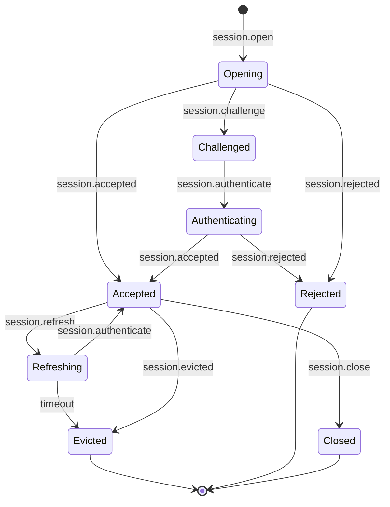
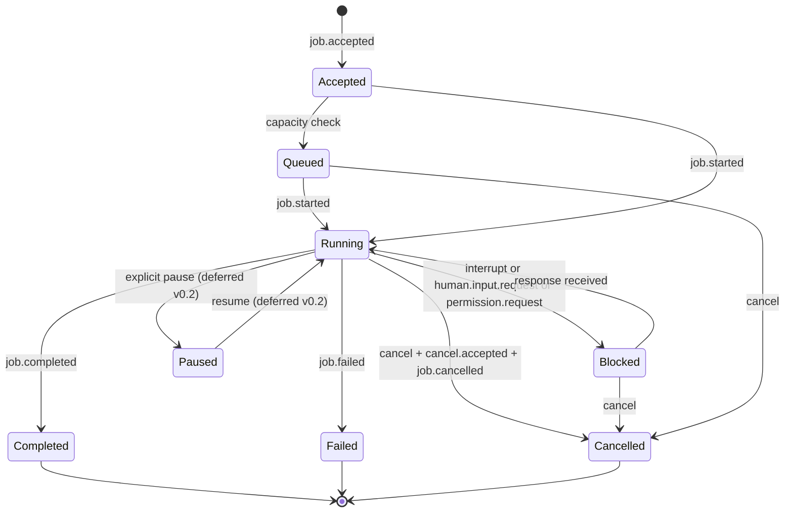
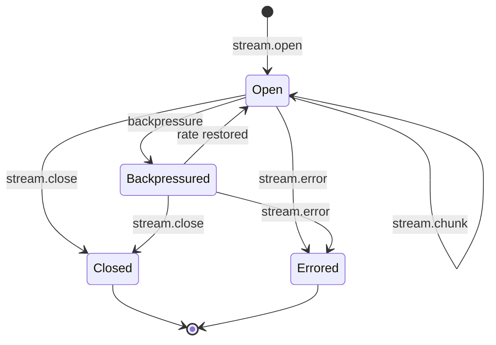
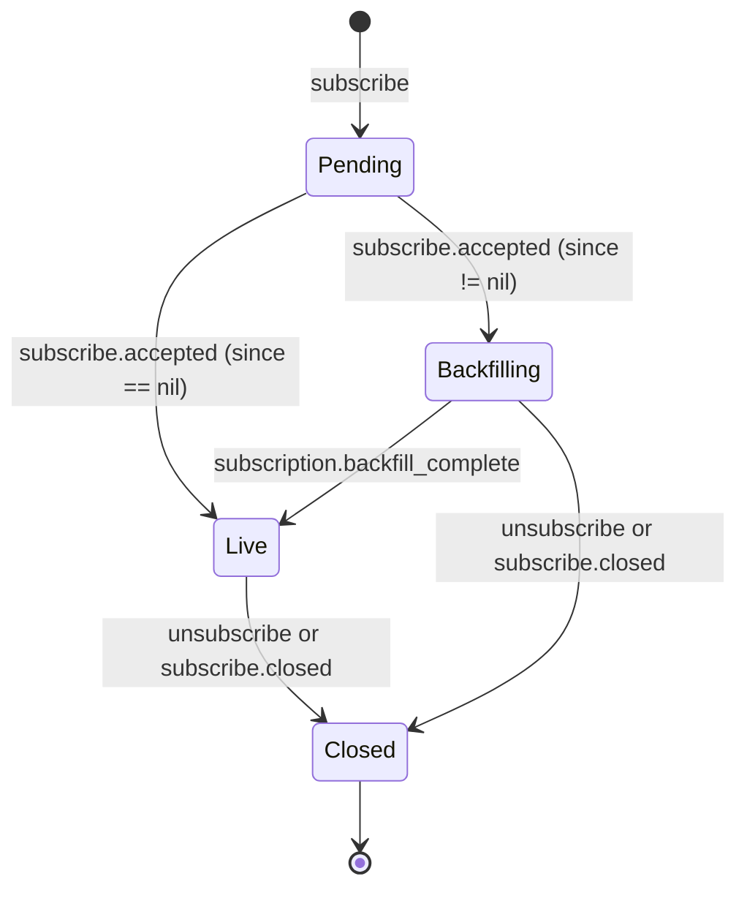
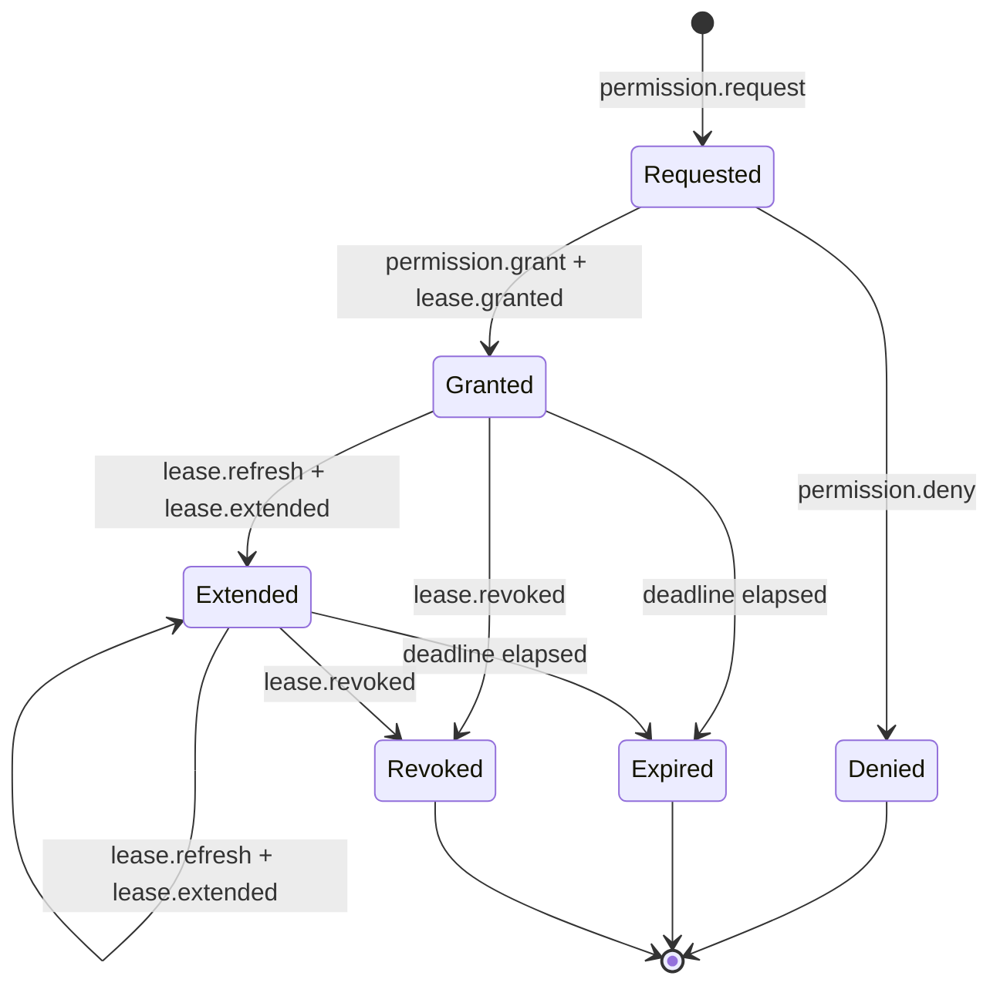

# Plan — ARCP Swift SDK v0.1

This plan governs the v0.1 Swift reference implementation of the **Agent Runtime
Control Protocol** (ARCP) defined in [`RFC-0001-v2.md`](RFC-0001-v2.md). It is
written before any production code is committed and is the source of truth for
phase ordering, scope, and design decisions.

The plan is intentionally opinionated. Where the RFC is silent, the chosen
interpretation is recorded here so future readers can audit *why*, not just
*what*.

---

## 1. Compass

ARCP defines *how* execution occurs between agent runtimes, clients, and
observers — sessions, durable jobs, streams, human-in-the-loop, permissions,
artifacts, observability. ARCP is transport-agnostic. This SDK ships a Swift
package, `ARCP`, that implements every in-scope message type from the RFC
across two reference transports (WebSocket, stdio) plus an in-memory transport
for tests, with a SQLite-backed event log for idempotency, replay, and resume.

The mission of this SDK is to be **provably conformant**, **boringly readable**,
and **immune to drift** between the wire and the in-process model. Every public
type is named after the RFC. Every payload struct is round-trip safe under
JSONEncoder / JSONDecoder. Every actor's invariants are reproduced in tests.

Swift 6.0 is the floor. Strict concurrency is enabled via `.swiftLanguageMode(.v6)`
on every target — there is no opt-out. Apple's `swift-format` is the canonical
formatter and runs in `--strict` mode at every gate.

---

## 2. Scope (lifted from the build prompt and pinned)

### In scope for v0.1

| RFC section | Surface |
|---|---|
| §6.1 | Envelope, including `idempotency_key`, `priority`, `extensions`, `correlation_id`, `causation_id` |
| §7   | Capability negotiation |
| §8   | `bearer`, `signed_jwt`, `none` (via negotiated `anonymous` capability) |
| §9   | Stateless and stateful sessions |
| §10  | Job state machine, heartbeats, cancellation, interrupts |
| §11  | `text`, `event`, `log`, `thought` stream kinds; backpressure; **base64 binary only** |
| §12  | `human.input.*`, `human.choice.*`, expiration with default fallback |
| §13  | Subscriptions: filters, backfill, `subscribe.closed`, `subscription.backfill_complete` |
| §15  | Permission challenge flow, lease lifecycle (granted/extended/revoked/refresh) |
| §16  | Inline base64 artifacts; `artifact.put/fetch/ref/release` |
| §17  | `log`, `metric` (with reserved metric names), `trace.span`; trace propagation via `TaskLocal` |
| §18  | Canonical error taxonomy as enum with associated values |
| §19  | Resume by `after_message_id` only |
| §21  | Extension registry; namespacing rules; unknown-message handling |
| §22  | WebSocket and stdio transports |

### Out of scope for v0.1 (stub or skip cleanly via `ARCPError.unimplemented`)

- HTTP/2 and QUIC transports
- mTLS and OAuth2 auth schemes
- Sidecar binary stream frames (transports that natively support them still use base64 in v0.1)
- Scheduled jobs (`job.schedule`, §10.6)
- Multi-agent delegation/handoff (`agent.delegate`, `agent.handoff`, §14)
- Workflow primitives (`workflow.start`/`workflow.complete`)
- Trust elevation (§15.6)
- Checkpoint-based resume (§19); message-id resume only
- Artifact retention/GC beyond a periodic expiry sweep
- Quorum response policies for human input (first-response-wins only)
- Apple-only platforms (iOS/tvOS/watchOS) — v0.2
- Embedded Swift target

A public API that depends on any out-of-scope feature **MUST** throw
`ARCPError.unimplemented(section: "§X.Y", detail: "...")`. There is no half-cut.

---

## 3. RFC sections by impact

This section summarizes each RFC section that touches implementation. It exists
so future contributors can locate the wire definition for any concept the SDK
exposes without re-reading the entire spec.

### §3 Terminology
Adopted verbatim. The SDK's public types reuse these names (`Session`, `Job`,
`Stream`, `Lease`, `Artifact`, `Subscription`, `Identity`, `Heartbeat`,
`Extension`, `Observer`).

### §4 Design Principles
The SDK respects all seven principles. The two most architecturally weighty:

- **§4.6 Authenticated by Default.** A new `Session` actor enforces that no
  non-handshake messages are accepted before `session.accepted`. Anonymous mode
  requires a negotiated `capabilities.anonymous` flag. The `none` auth scheme is
  refused otherwise.
- **§4.7 Extensible.** The `ExtensionRegistry` validates namespaces (`arcpx.*`
  or reverse-DNS) and decides unknown-message disposition per §21.3. Unknown
  types never crash the runtime.

### §5 Architecture
Three principal client roles are first-class in the API:
- **Active client** — `ARCPClient` with `invoke()`, `subscribe()`, `respond()`.
- **Observer** — `ARCPClient.observer(...)` factory; only `subscribe()`.
- **Peer runtime** — deferred to v0.2 (`agent.delegate`/`agent.handoff` not in scope).

### §6.1 Envelope
The envelope is a struct with the metadata fields from the RFC and a
discriminated-union `MessageType` payload. Custom `Codable` is required because
Swift's stock `Codable` doesn't natively support tag/payload polymorphism. The
codec is centralized in [`Envelope.swift`](Sources/ARCP/Envelope/Envelope.swift)
+ [`MessageType.swift`](Sources/ARCP/Envelope/MessageType.swift).

### §6.2 Message Types
See §5 below for the complete mapping table.

### §6.3 Command/Result/Event Flow
Direct invocations terminate with `tool.result`/`tool.error`. Durable jobs
terminate with `job.completed`/`job.failed`/`job.cancelled`. The runtime
guarantees exactly one terminal event per command.

### §6.4 Delivery Semantics
- `id` is the transport idempotency key. The `EventLog` rejects duplicates with
  `INSERT OR IGNORE` keyed on `(SessionId, MessageId)`.
- `idempotency_key` is the logical idempotency key. The runtime persists
  `(session_principal, idempotency_key)` and replays the prior outcome rather
  than re-executing.
- Ordering is guaranteed only within `stream_id` / `job_id`. The runtime
  preserves this with single-actor isolation per stream/job.

### §6.5 Priority
Four levels: `low`, `normal`, `high`, `critical`. Default `normal`. The
`SubscriptionManager` and `StreamManager` shed `low` first under backpressure.
Priority never reorders within a `stream_id` or `job_id`.

### §7 Capability Negotiation
A `Capabilities` struct with the eleven keys plus `extensions`. Boolean
capabilities default to `false` at the type system level (`Bool` properties
with `false` defaults). Required-but-unsupported features cause
`session.rejected` with `code: UNIMPLEMENTED`.

### §8 Authentication & Identity
Three schemes for v0.1:
- `bearer`: opaque token; runtime calls `BearerAuthValidator.validate(token:)`.
- `signed_jwt`: JWT validated via `jwt-kit`; `aud` must match runtime identity.
- `none`: only valid if `anonymous` capability negotiated.

`mtls` and `oauth2` throw `.unimplemented(section: "§8.2", ...)`. The four-step
handshake is enforced by the `Session` actor's state machine — the compiler
checks exhaustiveness because state is an enum with associated values.

### §9 Sessions
- **Stateless**: every command starts fresh.
- **Stateful**: `Session` actor holds memory and shared context. Cleared on close.
- **Durable**: deferred. `Session.policy.durable` returns `false` always in v0.1.

### §10 Jobs
The job state machine is implemented as a Swift enum with associated values, so
the compiler catches every transition that mishandles a state (see §6 below for
the diagram). Heartbeats use a dedicated watchdog `Task` per job. `N=2` missed
deadlines transition the job to `failed` with `HEARTBEAT_LOST`. Cancellation is
cooperative via `Task.checkCancellation()` and `withTaskCancellationHandler`.
Hard escalation after the deadline emits `code: ABORTED`.

### §11 Streaming
Streams are `AsyncStream<StreamChunk>` (or `AsyncThrowingStream` if the chunk
type is fallible). The `kind` is a Swift enum. `binary` accepts only base64 in
v0.1. Backpressure is detected by the consumer's drain rate vs. the producer's
yield rate; when the buffer fills, the runtime emits a `backpressure` envelope.

### §12 Human-in-the-Loop
`PendingRegistry` actor pairs `MessageId`s with `CheckedContinuation`s. A
sibling `Task.sleep(until:expires_at)` races the response. On expiry: if
`default` is set, the runtime synthesizes a response with `responded_by:
"default"`. Otherwise it emits `human.input.cancelled` with `code:
DEADLINE_EXCEEDED`.

Schema validation against `response_schema` is **not** wired in v0.1 because no
mature pure-Swift JSON Schema validator exists at the time of writing. Acceptable
fallback: validate the response is decodable as the declared Swift type and
reject otherwise. Documented as v0.2 work.

### §13 Subscriptions
`SubscriptionManager` actor compiles a filter once at subscribe time, authorizes
it once (§13.2), and applies it per published envelope. Backfill is replayed
from the `EventLog` first, then a synthetic `subscription.backfill_complete`
event is emitted, then live tail begins. Filter conditions: `session_id`,
`trace_id`, `job_id`, `stream_id`, `types`, `min_priority`, AND across fields,
OR within arrays.

### §15 Permissions & Leases
`PermissionRequest` blocks the job. `LeaseManager` actor mints leases on
`permission.grant`. Each lease has `lease_id`, `permission`, `resource`,
`operation`, `expires_at`. Leases can be refreshed (`lease.refresh` →
`lease.extended`), revoked (`lease.revoked`), or expired (a periodic
`Task.sleep` sweep). Operations attempted with expired/revoked leases fail with
`PERMISSION_DENIED`.

### §16 Artifacts
v0.1 stores artifacts inline (base64 in `payload.data`) or in SQLite blobs.
`artifact.ref` carries `artifact_id`, `uri`, `media_type`, `size`, `sha256`,
`expires_at`. The `ArtifactStore` enforces retention via a periodic sweep.

### §17 Observability
- `log` envelopes go to `swift-log`'s structured-metadata API.
- `metric` envelopes use the reserved names from §17.3.1, exposed as `static
  let` constants on `StandardMetric`.
- `trace.span` envelopes propagate via `@TaskLocal` (`Tracing.current`). Cross-
  runtime propagation happens at envelope serialization: `trace_id` and
  `span_id` flow into envelope metadata automatically.

### §18 Error Model
`ARCPError` is an enum with associated values per the §18.2 taxonomy. Each case
provides typed context — e.g. `.leaseExpired(leaseId: LeaseId, expiredAt:
Date)`. Computed properties: `code: ErrorCode`, `isRetryable: Bool`. All public
APIs throw `ARCPError`.

### §19 Resumability
v0.1 supports `resume.after_message_id` only. The `EventLog` replays via
`AsyncStream` from the last observed message, then live tail continues.
Checkpoint-based resume is deferred. If the requested message id is older than
the retention window, the runtime emits `code: DATA_LOSS`.

### §21 Extensions
`ExtensionRegistry` validates `arcpx.*` and reverse-DNS namespaces, enforces
the v-suffix versioning convention, and applies the §21.3 unknown-message
handling rules. The bare `x-` prefix is reserved for transport-internal
experiments and rejected on the wire.

### §22 Reference Transports
- `Transport` is a protocol with `send(_:)`, `receive: AsyncStream<Envelope>`,
  `close()`.
- `WebSocketTransport` uses `vapor/websocket-kit` (server + client) on top of
  `swift-nio`.
- `StdioTransport` is newline-delimited JSON over `FileHandle.standardInput`/
  `.standardOutput`. Tests spawn subprocesses via `Foundation.Process`.
- `MemoryTransport` is a paired in-process channel used heavily by integration
  tests.

---

## 4. Out-of-band ambiguities and chosen interpretations

These are the spots where the RFC is silent or where two reasonable readings
exist. Each is recorded here so the implementation can be audited later.

1. **§6.1 `priority` default.** The RFC says default `normal` but doesn't
   prescribe behavior when the field is omitted entirely. **Chosen:** decode
   missing `priority` as `.normal`; encode `.normal` explicitly so re-emitted
   envelopes are stable.

2. **§6.4 idempotency key persistence horizon.** The RFC says "at least the
   lease horizon of the operation." **Chosen:** persist `(session_principal,
   idempotency_key)` for `max(24h, lease_horizon)` per §6.4. Configurable.

3. **§7 unknown capability keys.** The RFC defines a fixed set but invites
   extensions. **Chosen:** unknown boolean keys decode to a separate
   `Capabilities.extras: [String: Bool]` map. Round-trip preserves them.

4. **§10.3 heartbeat default `N`.** The RFC says default `N = 2`. **Chosen:**
   `2`, exposed as `heartbeatMissThreshold`.

5. **§10.4 cancellation deadline elapsed without progress.** The RFC says the
   runtime "MAY" escalate. **Chosen:** default policy is to escalate after
   `deadline_ms`, configurable per-job to "never_escalate" for advanced cases.

6. **§11.2 backpressure threshold.** The RFC doesn't prescribe one. **Chosen:**
   the runtime emits backpressure when the underlying buffer hits 80% capacity
   and clears at 50%, both configurable.

7. **§11.3 `payload.sha256` for binary chunks.** Marked optional. **Chosen:**
   always compute and include for `kind: binary` chunks. Cheap and unambiguous.

8. **§12.4 expiration default fallback.** The RFC says the runtime "MAY"
   synthesize a response when `default` is set. **Chosen:** always synthesize
   when `default` is set; only emit `human.input.cancelled` if no default.

9. **§13.3 backfill ordering.** The RFC requires a sentinel but doesn't
   prescribe ordering during backfill. **Chosen:** strictly monotonic by event
   log row id (ULID-based, time-ordered). This matches `id`-based resume.

10. **§15.5 lease refresh policy.** The RFC defines the messages but not the
    grant policy. **Chosen:** the grantor's policy is pluggable via
    `LeasePolicy` protocol. Default policy: extend by the lesser of the
    requested duration and the original lease duration.

11. **§17.3.1 metric values.** The RFC defines the names but allows any
    numeric value. **Chosen:** all standard metrics are `Double`. Counters use
    integer `Double`s; rates and ratios use fractional `Double`s.

12. **§18.2 `RATE_LIMITED` alias.** The RFC says it's an alias for
    `RESOURCE_EXHAUSTED`. **Chosen:** `ErrorCode.resourceExhausted` is the
    canonical case. `.rateLimited` exists as a static factory that constructs
    the same case. Wire decoding accepts both spellings.

---

## 5. Message-type → Swift mapping

Every in-scope message type is enumerated. Each row maps the wire `type` string
to a `MessageType` enum case and a payload struct under `Sources/ARCP/Messages/`.

| Wire type | `MessageType` case | Payload struct | Group |
|---|---|---|---|
| `session.open` | `.sessionOpen(_)` | `SessionOpenPayload` | Session |
| `session.challenge` | `.sessionChallenge(_)` | `SessionChallengePayload` | Session |
| `session.authenticate` | `.sessionAuthenticate(_)` | `SessionAuthenticatePayload` | Session |
| `session.accepted` | `.sessionAccepted(_)` | `SessionAcceptedPayload` | Session |
| `session.unauthenticated` | `.sessionUnauthenticated(_)` | `SessionUnauthenticatedPayload` | Session |
| `session.rejected` | `.sessionRejected(_)` | `SessionRejectedPayload` | Session |
| `session.refresh` | `.sessionRefresh(_)` | `SessionRefreshPayload` | Session |
| `session.evicted` | `.sessionEvicted(_)` | `SessionEvictedPayload` | Session |
| `session.close` | `.sessionClose(_)` | `SessionClosePayload` | Session |
| `ping` | `.ping(_)` | `PingPayload` | Control |
| `pong` | `.pong(_)` | `PongPayload` | Control |
| `ack` | `.ack(_)` | `AckPayload` | Control |
| `nack` | `.nack(_)` | `NackPayload` | Control |
| `cancel` | `.cancel(_)` | `CancelPayload` | Control |
| `cancel.accepted` | `.cancelAccepted(_)` | `CancelAcceptedPayload` | Control |
| `cancel.refused` | `.cancelRefused(_)` | `CancelRefusedPayload` | Control |
| `interrupt` | `.interrupt(_)` | `InterruptPayload` | Control |
| `resume` | `.resume(_)` | `ResumePayload` | Control |
| `backpressure` | `.backpressure(_)` | `BackpressurePayload` | Control |
| `tool.invoke` | `.toolInvoke(_)` | `ToolInvokePayload` | Execution |
| `tool.result` | `.toolResult(_)` | `ToolResultPayload` | Execution |
| `tool.error` | `.toolError(_)` | `ToolErrorPayload` | Execution |
| `job.accepted` | `.jobAccepted(_)` | `JobAcceptedPayload` | Execution |
| `job.started` | `.jobStarted(_)` | `JobStartedPayload` | Execution |
| `job.progress` | `.jobProgress(_)` | `JobProgressPayload` | Execution |
| `job.heartbeat` | `.jobHeartbeat(_)` | `JobHeartbeatPayload` | Execution |
| `job.completed` | `.jobCompleted(_)` | `JobCompletedPayload` | Execution |
| `job.failed` | `.jobFailed(_)` | `JobFailedPayload` | Execution |
| `job.cancelled` | `.jobCancelled(_)` | `JobCancelledPayload` | Execution |
| `stream.open` | `.streamOpen(_)` | `StreamOpenPayload` | Streaming |
| `stream.chunk` | `.streamChunk(_)` | `StreamChunkPayload` | Streaming |
| `stream.close` | `.streamClose(_)` | `StreamClosePayload` | Streaming |
| `stream.error` | `.streamError(_)` | `StreamErrorPayload` | Streaming |
| `human.input.request` | `.humanInputRequest(_)` | `HumanInputRequestPayload` | Human |
| `human.input.response` | `.humanInputResponse(_)` | `HumanInputResponsePayload` | Human |
| `human.choice.request` | `.humanChoiceRequest(_)` | `HumanChoiceRequestPayload` | Human |
| `human.choice.response` | `.humanChoiceResponse(_)` | `HumanChoiceResponsePayload` | Human |
| `human.input.cancelled` | `.humanInputCancelled(_)` | `HumanInputCancelledPayload` | Human |
| `permission.request` | `.permissionRequest(_)` | `PermissionRequestPayload` | Permissions |
| `permission.grant` | `.permissionGrant(_)` | `PermissionGrantPayload` | Permissions |
| `permission.deny` | `.permissionDeny(_)` | `PermissionDenyPayload` | Permissions |
| `lease.granted` | `.leaseGranted(_)` | `LeaseGrantedPayload` | Permissions |
| `lease.extended` | `.leaseExtended(_)` | `LeaseExtendedPayload` | Permissions |
| `lease.revoked` | `.leaseRevoked(_)` | `LeaseRevokedPayload` | Permissions |
| `lease.refresh` | `.leaseRefresh(_)` | `LeaseRefreshPayload` | Permissions |
| `subscribe` | `.subscribe(_)` | `SubscribePayload` | Subscriptions |
| `subscribe.accepted` | `.subscribeAccepted(_)` | `SubscribeAcceptedPayload` | Subscriptions |
| `subscribe.event` | `.subscribeEvent(_)` | `SubscribeEventPayload` | Subscriptions |
| `unsubscribe` | `.unsubscribe(_)` | `UnsubscribePayload` | Subscriptions |
| `subscribe.closed` | `.subscribeClosed(_)` | `SubscribeClosedPayload` | Subscriptions |
| `artifact.put` | `.artifactPut(_)` | `ArtifactPutPayload` | Artifacts |
| `artifact.fetch` | `.artifactFetch(_)` | `ArtifactFetchPayload` | Artifacts |
| `artifact.ref` | `.artifactRef(_)` | `ArtifactRefPayload` | Artifacts |
| `artifact.release` | `.artifactRelease(_)` | `ArtifactReleasePayload` | Artifacts |
| `event.emit` | `.eventEmit(_)` | `EventEmitPayload` | Telemetry |
| `log` | `.log(_)` | `LogPayload` | Telemetry |
| `metric` | `.metric(_)` | `MetricPayload` | Telemetry |
| `trace.span` | `.traceSpan(_)` | `TraceSpanPayload` | Telemetry |
| (extension) | `.unknown(_)` | `UnknownPayload` | Extensions |

Out-of-scope wire types (`job.checkpoint`, `job.schedule`, `workflow.start`,
`workflow.complete`, `agent.delegate`, `agent.handoff`, `checkpoint.create`,
`checkpoint.restore`) are decoded as `.unknown` and rejected per §21.3 with
`UNIMPLEMENTED`.

---

## 6. State machines

### 6.1 Session



Modeled in Swift as `enum SessionState { case opening, challenged(Challenge),
authenticating, accepted(SessionId), refreshing, evicted(reason: SessionEvictReason),
rejected(code: ErrorCode), closed }`. Compile-time exhaustive.

### 6.2 Job



### 6.3 Stream



### 6.4 Subscription



### 6.5 Lease



---

## 7. Test plan

Tests are written with `swift-testing` (`@Test`/`#expect`) — never XCTest. They
are split into unit (one file per source module), integration (full handshake
and lifecycle scenarios), and end-to-end (multi-actor scenarios driven via the
relay sample).

### Unit (Phase 1–5)
- `EnvelopeTests` — encoder/decoder round-trip on every message variant; canonical
  snapshot tests; conditional-field validation (`session_id` required after
  handshake); `correlation_id`/`causation_id` preservation.
- `IdsTests` — encode-as-string; reject empty; type wrappers cannot cross-compare.
- `ErrorsTests` — every case constructible; `code` and `isRetryable` correct;
  associated context preserved through `.internal(cause:)` wrapping.
- `MessagesTests` — decode every payload from a canonical JSON fixture.
- `ExtensionsTests` — namespace acceptance (`arcpx.x.v1`, `com.acme.x.v1`),
  rejection (`x-foo`, malformed), unknown-message disposition (drop with
  `extensions.optional: true`, otherwise `UNIMPLEMENTED`).
- `EventLogTests` — `INSERT OR IGNORE` semantics; replay ordering; deduplication.

### Integration (Phase 2–6)
- `HandshakeTests` — happy path, challenge/response, rejection, missing
  required capabilities, anonymous vs `none`.
- `JobLifecycleTests` — accept, start, progress, heartbeat, complete; happy and
  failed/cancelled terminations; one-and-only-one terminal event.
- `HumanInputTests` — request/response, choice, expiration with default,
  expiration without default emits `human.input.cancelled`, schema validation
  fallback (Swift type decode).
- `PermissionLeaseTests` — challenge, grant emits lease, refresh extends,
  revoke fails subsequent ops with `LEASE_REVOKED`, expiry fails with
  `LEASE_EXPIRED`.
- `SubscriptionTests` — filter dimensions; backfill ordering; backfill→live
  boundary; auth-expiry termination via `subscribe.closed`; unauthorized filter
  rejected.
- `CancellationTests` — cooperative cancel, deadline escalation to `ABORTED`,
  refusal when not cancellable.
- `InterruptTests` — interrupt → blocked → human.input.request → response →
  running.
- `ArtifactTests` — `put`, `fetch`, `ref`, `release`, retention sweep.
- `ResumeTests` — reconnect after kill; replay from `after_message_id`; older
  retention emits `DATA_LOSS`.
- `ExtensionUnknownTests` — `extensions.optional: true` drops vs. `nack
  UNIMPLEMENTED`.

### End-to-end (Phase 7)
- `RelayScenarioTests` — multi-destination human input fan-out; first-response-
  wins; other channels notified via `human.input.cancelled`. Run against both
  WebSocket and stdio transports via `@Test(arguments:)` parameterization.

### Performance gates
- In-process round-trip latency for `human.input.request` <50ms p99.
- Heartbeat tests run with an injected `Clock` (Swift 5.7+ `Clock` protocol), so
  they're deterministic and run in milliseconds rather than seconds.

---

## 8. Swift-specific design notes

These are deliberate, recorded so reviewers can see the language choices at a
glance.

1. **Strict concurrency is non-negotiable.** Every target uses
   `.swiftLanguageMode(.v6)`. Swift 6 mode implies strict concurrency complete
   — no separate flag is needed.

2. **Sendability everywhere.** Every payload struct is `Sendable`. Every
   public type that crosses an actor boundary is `Sendable`. `@unchecked
   Sendable` is forbidden without a justifying comment.

3. **Actors for stateful types.** `ARCPRuntime`, `Session`, `JobManager`,
   `StreamManager`, `SubscriptionManager`, `ArtifactStore`, `LeaseManager`,
   `PendingRegistry` are all actors. No locks, no `DispatchQueue`.

4. **Enums + Codable for envelope dispatch.** `MessageType` is an enum with
   associated values; `switch` is exhaustive and compiler-checked. Custom
   `Codable` is implemented once on `Envelope` — it reads the `type` string,
   then delegates to a per-case decoder.

5. **AsyncStream/AsyncSequence for streams.** Streams and subscriptions
   surface as `AsyncStream<T>` / `AsyncThrowingStream<T>` so consumers iterate
   with `for await`. Backpressure messages are an explicit envelope, not
   built-in `AsyncStream` buffering policy alone.

6. **CheckedContinuation for pending requests.** `PendingRegistry` uses
   `withCheckedThrowingContinuation` for the response wait, races a
   `Task.sleep(until: deadline)` for expiration. Single-resume is enforced at
   runtime by `CheckedContinuation`.

7. **TaskLocal for trace context.** `Tracing.current: TraceContext?` is
   `@TaskLocal`; `withTrace(_:_:)` wraps a closure in the context. Propagation
   across `await` is automatic and unwinds with task scope.

8. **Clock injection for time.** Heartbeat watchdog, lease expiry, request
   expiry all take a `Clock` (Swift's `Clock` protocol). `ContinuousClock` for
   prod, a custom `TestClock` (or swift-testing's clock) for tests.

9. **`swift-log` for diagnostics.** Library code never calls `print`. The CLI
   may. Loggers are scoped per component (`Logger(label: "arcp.runtime")`,
   `Logger(label: "arcp.session.\(id)")`).

10. **No `Any` in public APIs.** `JSONValue` is the public boundary type for
    arbitrary JSON content (e.g. `tool.invoke.payload.arguments`,
    `human.input.response.payload.value`). Internally, `Any` is only used at
    the SQLite interop layer and is wrapped in typed views before crossing the
    public boundary.

11. **No force-unwraps or `try!`.** Where unreachable cases must be marked,
    `precondition(false, "...")` with a message is preferred. `try!` is
    permitted only in test setup of objects that genuinely cannot fail.

12. **Deterministic ULID ids.** A 50-line ULID implementation lives in
    `Ids/Ulid.swift`. ULIDs are time-ordered, monotonic within a single
    process, and case-insensitive Crockford base32 — perfect for both message
    ids and event-log row keys.

13. **Cross-platform.** Linux and macOS are equal-tier. iOS/tvOS/watchOS are
    deferred. WebSocket uses `vapor/websocket-kit` (built on `swift-nio`)
    instead of `URLSessionWebSocketTask` for Linux compatibility. SQLite uses
    `stephencelis/SQLite.swift` (pure Swift on top of system libsqlite).

---

## 9. Dependencies

Pinned in [`Package.swift`](Package.swift). Each is justified:

| Dependency | Why |
|---|---|
| `apple/swift-log` | Apple-blessed structured logging facade. |
| `apple/swift-argument-parser` | CLI parser with `AsyncParsableCommand`. |
| `apple/swift-nio` | Networking foundation; underlies the WebSocket transport. |
| `vapor/websocket-kit` | Cross-platform server+client WebSocket on `swift-nio`; works on Linux unlike `URLSessionWebSocketTask`. |
| `vapor/jwt-kit` | JWT validation for `signed_jwt` auth scheme; consistent across platforms. |
| `stephencelis/SQLite.swift` | Mature pure-Swift SQLite wrapper for the `EventLog` and `ArtifactStore`. |
| `apple/swift-format` | Canonical formatter; runs as build-tool plugin in `--strict` mode at every gate. |
| `swiftlang/swift-docc-plugin` | DocC documentation generation; required by Gate 7. |

Adding a new dependency requires appending a row to this table and a one-line
justification.

JSON Schema validation for `human.input.request.response_schema` is **not** in
v0.1. No mature pure-Swift validator exists; the v0.1 fallback is to validate
the response is decodable as the declared Swift type. Tracked as v0.2 work.

---

## 10. Phase plan and gate commands

Phases run strictly in order. Gates do not allow drift.

### Standard gate command set

```bash
swift package plugin --allow-writing-to-package-directory format-source-code
swift package plugin lint-source-code -- --strict
swift build -c release -Xswiftc -warnings-as-errors
swift test --parallel --enable-code-coverage
swift package generate-documentation --target ARCP
```

All five must exit 0. Treat any compiler warning as an error. (Note: the Apple
swift-format SwiftPM plugin commands are `format-source-code` and
`lint-source-code`, not `swift-format format`/`lint` — the build prompt's gate
names were approximate; this is the actual invocation.)

### Phase 0 — Plan + skeleton (this phase)
Goal: PLAN.md substantive, package compiles, gates clean, scaffold tests pass.

### Phase 1 — Envelope, IDs, Errors, Extensions, Event Log
Goal: every envelope round-trips; every `ARCPError` case constructs and
propagates; the SQLite event log dedupes and replays in order. Coverage ≥90% on
these files.

### Phase 2 — Messages, handshake, capability negotiation
Goal: every message-type payload struct exists; the four-step handshake works
over the in-memory transport; rejecting required-but-unsupported capabilities
emits `session.rejected` with `code: UNIMPLEMENTED`.

### Phase 3 — Jobs, Streams, Cancellation, Interrupts (largest)
Goal: full job state machine; heartbeat watchdog deterministic under injected
clock; cooperative cancellation with deadline escalation; interrupt transitions
to `blocked` and emits `human.input.request`; backpressure honored with
`bufferingNewest`-driven explicit envelopes.

### Phase 4 — Human-in-the-loop, permissions, leases
Goal: `PendingRegistry` actor with continuation+sleep race; expiration with
default fallback; permission challenge and lease lifecycle (granted, refreshed,
revoked, expired). In-process p99 round-trip <50ms.

### Phase 5 — Subscriptions, Artifacts, Resume
Goal: filter compile + auth at subscribe time; backfill→live boundary marker;
inline base64 artifact lifecycle; resume after forced disconnect via
`after_message_id` only.

### Phase 6 — Transports
Goal: WebSocket server+client over `websocket-kit` with reconnect+jitter;
stdio newline-delimited JSON; full integration suite parameterized via
`@Test(arguments:)` against both transports.

### Phase 7 — CLI, samples, docs
Goal: `arcp serve|tail|send|replay`; six runnable samples; `RelayScenarioTests`
green on both transports; coverage ≥85%; DocC has zero warnings; tag `v0.1.0`.

---

## 11. Definition of done

`v0.1.0` is published when **all** of the following hold:

1. All seven gates passed and committed in order.
2. `swift package plugin lint-source-code -- --strict` exits 0.
3. `swift build -c release -Xswiftc -warnings-as-errors` exits 0.
4. `swift test --parallel` exits 0.
5. Coverage ≥85% via `swift test --enable-code-coverage` + `xcrun llvm-cov`.
6. All six samples run clean.
7. `RelayScenarioTests` passes against both transports.
8. `CONFORMANCE.md` reflects the implementation honestly.
9. `README.md` quickstart works on a clean clone in under five minutes (Swift
   6 toolchain assumed).
10. No `// FIXME`, no `// XXX`, no `print` in library code, no force-unwraps
    outside guaranteed cases, no `Any` outside trust boundaries, no
    `@unchecked Sendable` without justification, no detached `Task` without
    supervision.
11. Tests run successfully on Linux and macOS.
12. DocC documentation builds cleanly.
