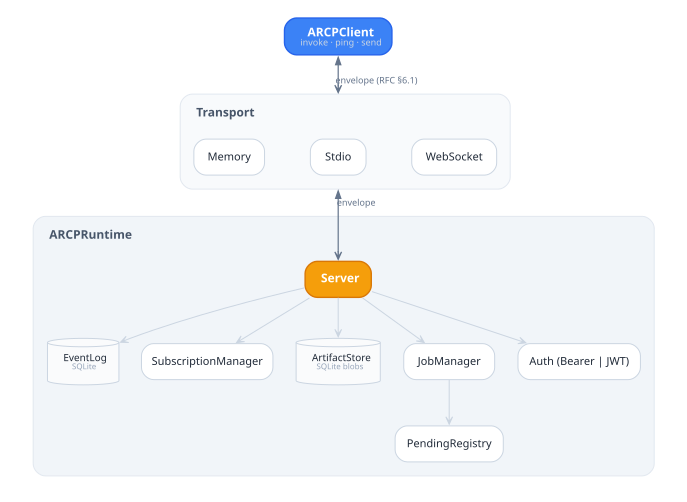

# ARCP — Swift SDK

Swift 6 reference implementation of the **Agent Runtime Control Protocol**
([ARCP spec](https://github.com/agentruntimecontrolprotocol/spec/blob/main/docs/draft-arcp-1.1.md)). Wire version: **1.1**. SDK version: **0.1.0**.

## Status

v0.1.0 — protocol fundamentals across the seven gated phases:

- ✅ Envelope, ids (ULID), errors, extension registry, SQLite event log
- ✅ Four-step handshake (RFC §8.1) with `bearer`, `signed_jwt`, `none` schemes
- ✅ Capability negotiation (RFC §7)
- ✅ Durable jobs with state machine, heartbeats, cooperative cancellation, interrupts
- ✅ Multi-kind streams (text, event, log, thought, metric, base64 binary) + backpressure
- ✅ Permission challenges + lease lifecycle (grant, refresh, revoke, expire sweep)
- ✅ Subscriptions with filter, backfill, `subscription.backfill_complete` boundary
- ✅ Inline-base64 artifacts with retention sweep
- ✅ Resume by `after_message_id`
- ✅ Transports: `MemoryTransport` (tests), `StdioTransport` (NDJSON), `WebSocketTransport` (client)

Out of scope for v0.1 (see [`CONFORMANCE.md`](CONFORMANCE.md)): mTLS / OAuth2 auth,
sidecar binary stream frames, scheduled jobs, multi-agent delegation/handoff,
trust elevation, checkpoint-based resume, full WebSocket server (the client
transport works; server is partial because `WebSocketKit.WebSocket`'s
server-side initializer is internal — full server lands in v0.2).

## Requirements

- Swift 6.0 toolchain or later (validated against 6.3.1)
- macOS 14+ or Linux (Ubuntu 22.04+ tested)

## Quickstart

```bash
git clone <this repo>
cd swift-sdk
swift run sample-01-minimal-session
```

Expected output:
```
Sample 01 — minimal session (wire 1.1)
session opened: sess_01...
pong nonce: hello
session closed
```

The other samples — `sample-02-tool-invoke-progress`,
`sample-03-permission-challenge`, `sample-04-observer-subscription` — each
demonstrate a distinct ARCP surface end-to-end via the in-memory transport.

## CLI

```bash
swift run arcp serve              # accept one ARCP session over stdio
swift run arcp send <tool> --args '{"k":"v"}'
swift run arcp tail               # subscribe and print events
swift run arcp replay <db> <session>
```

## Build & test (gate command set)

The seven phases of v0.1 each pass these five commands at exit code 0:

```bash
swift package plugin --allow-writing-to-package-directory format-source-code
swift package plugin lint-source-code -- --strict
swift build -c release -Xswiftc -warnings-as-errors
swift test --parallel --enable-code-coverage
swift package generate-documentation --target ARCP
```

## Architecture

<picture>
  <source media="(prefers-color-scheme: dark)" srcset="docs/diagrams/architecture-dark.svg">
  
</picture>

State diagrams for sessions, jobs, streams, subscriptions, and leases live
under [`docs/diagrams/`](docs/diagrams/).

## RFC mapping

Every in-scope wire message type maps to a `MessageType` enum case and
payload struct in [`Sources/ARCP/`](Sources/ARCP/). Out-of-scope types decode as
`.unknown(typeName:payload:)` and are rejected per RFC §21.3 with `UNIMPLEMENTED`
when a non-optional sender expects them.

## License

Apache License 2.0 — see [`LICENSE`](LICENSE) in this directory.
