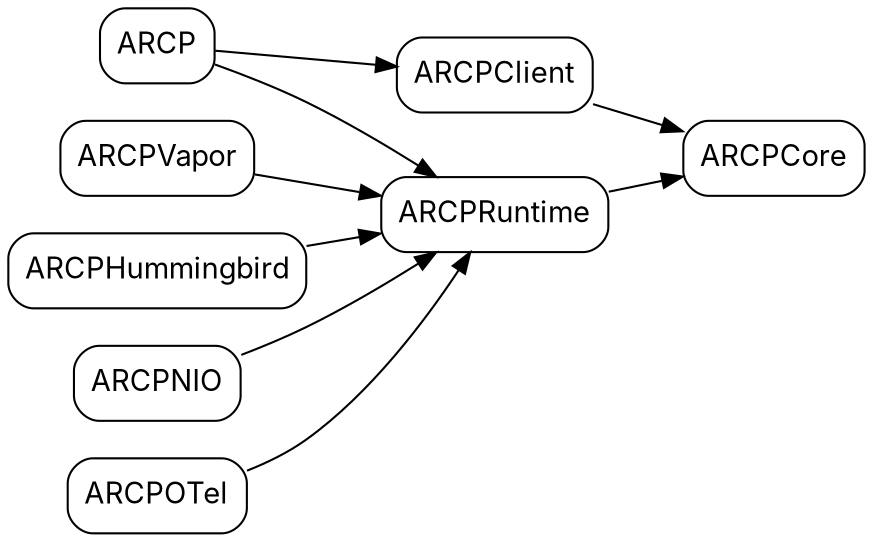
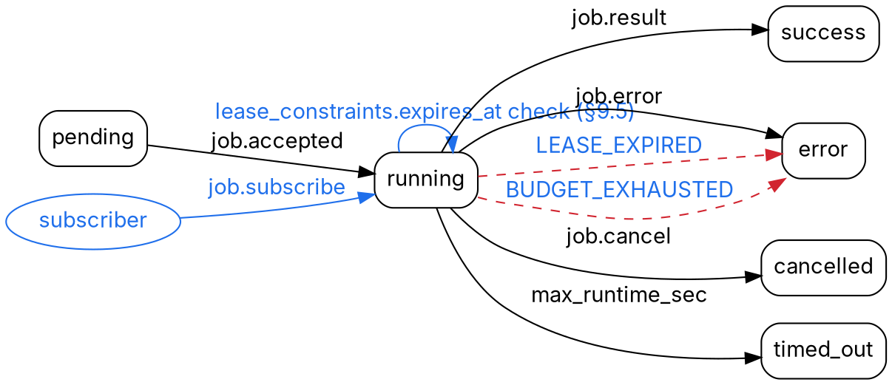

# 09 — Graphviz diagrams

Six `.dot` sources under `swift-sdk/docs/diagrams/`. SVG output is
generated by `dot`; no rendered SVG is committed from this plan
phase. Each diagram captures one specific contract from the spec or
from a planning phase; the file names below are normative.

> **Directory note:** `swift-sdk/docs/diagrams/` did not exist when
> this plan was written; the two skeletons in §3 below are dropped
> there as scaffolds. Create the directory in the PR that lands these
> diagrams; do not commit a `.gitkeep` once the four remaining files
> arrive.

## 1. Minimum diagram set

### 1.1 `docs/diagrams/target-dependency.dot`

**Shows.** The SwiftPM target graph after the Phase 4 split: the
core/client/runtime trio (`ARCPCore`, `ARCPClient`, `ARCPRuntime`), the
umbrella `ARCP`, and the four opt-in middleware targets (`ARCPVapor`,
`ARCPHummingbird`, `ARCPNIO`, `ARCPOTel`). Arrows are
`depends-on`. The diagram answers one question: what is allowed to
import what. Specifically: `ARCPCore` imports nothing in-tree;
`ARCPClient` and `ARCPRuntime` import only `ARCPCore`; the host
adapters import `ARCPRuntime` (and bring their framework dep in
parallel); `ARCPOTel` is the only target that imports
`swift-distributed-tracing`.

**Output.** `dot -Tsvg docs/diagrams/target-dependency.dot >
docs/diagrams/target-dependency.svg`.

**Source of truth.** Phase 4 architecture (`04-architecture.md`,
forthcoming); dep-routing rules in
[`03-libraries.md`](03-libraries.md) ("core/client shouldn't depend on
NIO transitively").

### 1.2 `docs/diagrams/session-fsm.dot`

**Shows.** The session state machine on the client side: `connecting →
hello-sent → welcomed → (resuming | closing) → closed`. Transitions
labelled with the wire event or trigger: `connect`, `hello`,
`welcome`, `bye`, `transport-loss`, `resume`. The
`RESUME_WINDOW_EXPIRED` transition out of `resuming` lands in
`closed` and is drawn as the red dashed error edge. The diagram
makes the resume-window timeout visually distinct from a normal
`bye`.

**Output.** `dot -Tsvg docs/diagrams/session-fsm.dot >
docs/diagrams/session-fsm.svg`.

**Source of truth.** Spec
[`§6.1`](../../../spec/docs/draft-arcp-02.1.md) (auth on hello),
[`§6.2`](../../../spec/docs/draft-arcp-02.1.md) (hello/welcome),
[`§6.3`](../../../spec/docs/draft-arcp-02.1.md) (resume,
`RESUME_WINDOW_EXPIRED`),
[`§6.7`](../../../spec/docs/draft-arcp-02.1.md) (clean close via
`session.bye`).

### 1.3 `docs/diagrams/job-fsm.dot`

**Shows.** The job state machine. Five non-terminal/terminal states
straight from §7.3: `pending`, `running`, `success`, `error`,
`cancelled`, `timed_out`. v1.1 additions appear as **annotations on
existing edges, not as new states** — the `LEASE_EXPIRED` and
`BUDGET_EXHAUSTED` transitions into `error` are labelled in blue
(`#1f6feb`) and drawn red-dashed (error edge); the diagram explicitly
notes neither code introduces a new terminal state per §7.3. Two
v1.1 side effects sit beside the `running` node: a `subscribe` arrow
(blue, async/event, solid) from an off-graph "subscriber session"
node into `running`, and a `lease_constraints` self-loop on `running`
labelled with the `expires_at` check per §9.5. Cancellation lands in
`cancelled` via `job.cancel` (§7.4). Runtime-side timeout enforcement
lands in `timed_out`.

**Output.** `dot -Tsvg docs/diagrams/job-fsm.dot >
docs/diagrams/job-fsm.svg`.

**Source of truth.** Spec
[`§7.3`](../../../spec/docs/draft-arcp-02.1.md),
[`§7.4`](../../../spec/docs/draft-arcp-02.1.md),
[`§7.6`](../../../spec/docs/draft-arcp-02.1.md),
[`§9.5`](../../../spec/docs/draft-arcp-02.1.md),
[`§9.6`](../../../spec/docs/draft-arcp-02.1.md); cross-reference
[`§12`](../../../spec/docs/draft-arcp-02.1.md) error taxonomy.

### 1.4 `docs/diagrams/capability-negotiation.dot`

**Shows.** Two-lifeline sequence: client (left) and runtime (right).
Three flows stacked top-to-bottom in the same diagram:

1. v1.1 ↔ v1.1: `session.hello` carries `capabilities.features: [9
   items]`; runtime replies `session.welcome` with the intersection.
2. v1.1 client ↔ v1.0 runtime: client sends `features`; runtime
   returns a v1.0-shape welcome (no `features` array). The diagram
   notes that the client's negotiated `Set<Feature>` is empty and
   that calls like `client.ack(seq)` MUST throw locally rather than
   produce wire traffic.
3. v1.0 client ↔ v1.1 runtime: client omits `features`; runtime
   advertises its full feature list anyway; the v1.0 client ignores
   the extra fields by §5.1 passthrough.

The two fallback flows draw the `features` line in blue (v1.1
additions); the unconditional welcome attributes (the rich `agents:
[{name, versions, default?}]` shape from §6.2) are also blue.

**Output.** `dot -Tsvg docs/diagrams/capability-negotiation.dot >
docs/diagrams/capability-negotiation.svg`.

**Source of truth.** Spec
[`§6.2`](../../../spec/docs/draft-arcp-02.1.md);
[`01-spec-delta.md`](01-spec-delta.md) §3.

### 1.5 `docs/diagrams/heartbeat-ack-flow.dot`

**Shows.** Sequence diagram, two lifelines (client / runtime). Three
stacked phases:

1. **Idle.** 30s elapses, neither side emits a job event. Client
   sends `session.ping{nonce, sent_at}`; runtime replies
   `session.pong{ping_nonce, received_at}`. The next interval the
   roles flip (runtime pings, client pongs). Heartbeat envelopes are
   noted as **excluded from `event_seq`** per §6.4.
2. **Chatty job + periodic ack.** Runtime emits a burst of
   `job.event[seq=1..100]`, client emits `session.ack{last_processed_seq:
   12}`, then `..28}` as it falls behind. The ack messages are
   noted as **also excluded from `event_seq`** per §6.5.
3. **Back-pressure status.** Runtime detects lag and emits
   `job.event{kind: "status", body: {phase: "back_pressure"}}` on
   the regular event_seq channel. The diagram annotates the
   threshold as implementation-defined.

`session.ping`/`session.pong`/`session.ack` envelopes draw in blue
(v1.1 additions). The back-pressure `status` event is the existing
v1.0 `status` kind; only the `back_pressure` phase value is new
language (advisory, not normative).

**Output.** `dot -Tsvg docs/diagrams/heartbeat-ack-flow.dot >
docs/diagrams/heartbeat-ack-flow.svg`.

**Source of truth.** Spec
[`§6.4`](../../../spec/docs/draft-arcp-02.1.md),
[`§6.5`](../../../spec/docs/draft-arcp-02.1.md),
[`§13.1`](../../../spec/docs/draft-arcp-02.1.md),
[`§13.2`](../../../spec/docs/draft-arcp-02.1.md).

### 1.6 `docs/diagrams/result-chunk-progress.dot`

**Shows.** Sequence diagram for a single job that streams its final
result. Two lifelines (client / runtime). The runtime emits, in
order:

1. Intermediate `job.event{kind: "progress", body: {current, total,
   units}}` events (§8.2.1) — the spec's example uses
   `current=47/total=120/units="files"`.
2. A run of `job.event{kind: "result_chunk", body: {result_id,
   chunk_seq, data, encoding, more}}` events. The diagram annotates
   `chunk_seq` as 0-based monotonic per `result_id` and notes the
   §14 chunk-size cap (1 MiB recommended, 256 MiB total) that the
   runtime enforces.
3. The terminating `job.result{final_status: "success", result_id,
   result_size, summary}` envelope per §8.4.

The `progress` and `result_chunk` kinds, plus the `result_id`/
`result_size` fields on `job.result`, draw in blue. The diagram
explicitly calls out the §8.4 invariant: once a `result_chunk` is
emitted, the terminating `job.result` MUST carry `result_id` and
MUST NOT carry inline payload.

**Output.** `dot -Tsvg docs/diagrams/result-chunk-progress.dot >
docs/diagrams/result-chunk-progress.svg`.

**Source of truth.** Spec
[`§8.2.1`](../../../spec/docs/draft-arcp-02.1.md),
[`§8.4`](../../../spec/docs/draft-arcp-02.1.md),
[`§13.6`](../../../spec/docs/draft-arcp-02.1.md);
[`02-current-audit.md`](02-current-audit.md) §3 (the chunk-assembly
H-risk row).

## 2. Shared style conventions

Every `.dot` opens with the same three default blocks. Diagrams that
need additional defaults (e.g., a record-shape for a sequence-diagram
lifeline) override locally rather than mutate the shared defaults.

```dot
graph [rankdir=LR, fontname="Inter"]
node  [shape=box, style=rounded, fontname="Inter"]
edge  [fontname="Inter"]
```

Sequence diagrams (`capability-negotiation.dot`,
`heartbeat-ack-flow.dot`, `result-chunk-progress.dot`) use
`rankdir=TB` so messages flow top-to-bottom; everything else stays
`LR`. The two FSM diagrams (`session-fsm.dot`, `job-fsm.dot`) use
`LR`.

**Colors.** One blue hex is locked in across the whole set:

| Role                 | Color                       |
| -------------------- | --------------------------- |
| v1.0 elements        | black (`#000000`)           |
| v1.1 additions       | blue (`#1F6FEB`)            |
| Error transitions    | red (`#D1242F`), dashed     |
| Async / event flows  | solid arrows                |
| Control replies      | dashed arrows               |

Apply colors to **edges and to labels for new wire fields**, not to
nodes whose role is unchanged between versions. The five v1.1-only
nodes that DO get blue fill: `session.ping`, `session.pong`,
`session.ack`, `session.list_jobs` / `session.jobs`, `job.subscribe`
/ `job.subscribed`.

**Naming.** Filenames are kebab-case with the `.dot` extension. The
rendered SVG sits next to the source as
`docs/diagrams/<name>.svg`. The shared docs site (Phase 8) and
DocC catalog (Phase 8 again) both reference these SVGs by relative
path; neither expects light/dark pairs (we are not mirroring the TS
SDK's `<picture>` pattern — single-variant SVGs render fine on both
themes when stroked black-on-transparent, and the blue-for-v1.1
encoding survives the theme swap).

## 3. `.dot` skeletons (this PR)

Two skeletons land in `docs/diagrams/` with this plan. The other
four are skeletoned in the doc-site PRs that own them (per Phase 8).

### 3.1 `docs/diagrams/target-dependency.dot`



(Final target list reconciles with Phase 4 once
`04-architecture.md` lands; if Phase 4 adds `ARCPStoreSQLite` as
an opt-in store target, add it here as an edge into `ARCPRuntime`.)

### 3.2 `docs/diagrams/job-fsm.dot`



The remaining four (`session-fsm`, `capability-negotiation`,
`heartbeat-ack-flow`, `result-chunk-progress`) ship as `.dot`
files in the docs-site PR; their spec citations and color rules
are fixed above.

## 4. Render command

Single shell loop to rebuild every diagram:

```bash
for f in docs/diagrams/*.dot; do
  dot -Tsvg "$f" -o "${f%.dot}.svg"
done
```

**Graphviz version floor:** `graphviz >= 9.0`. macOS Homebrew is on
12.x at time of writing; Ubuntu 24.04 LTS apt ships 2.42.x for the
plain `graphviz` package and 9.x via the `graphviz-dev` series — CI
installs the newer build. The 9.0 floor is needed for stable
`fontname="Inter"` fallback when the host lacks the font (older
versions emit broken SVG `<text>` nodes).

The render step belongs in the docs-site build, not in `swift build`
or `swift test`. SVGs are checked in alongside their `.dot` source
so the docs site and DocC can reference them without a build-time
Graphviz dependency.
